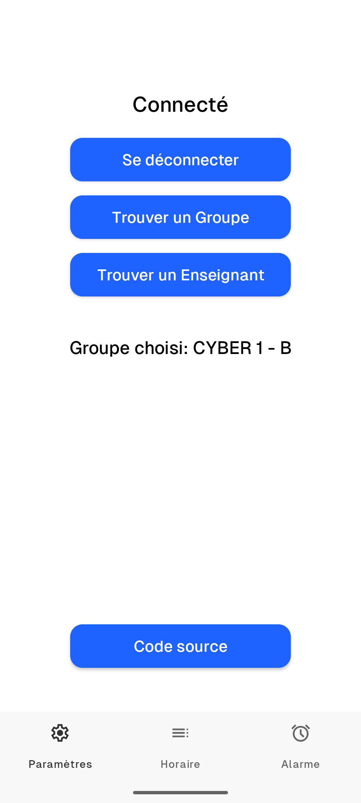
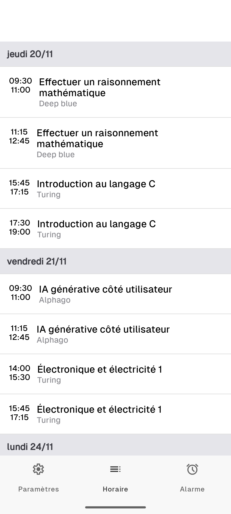
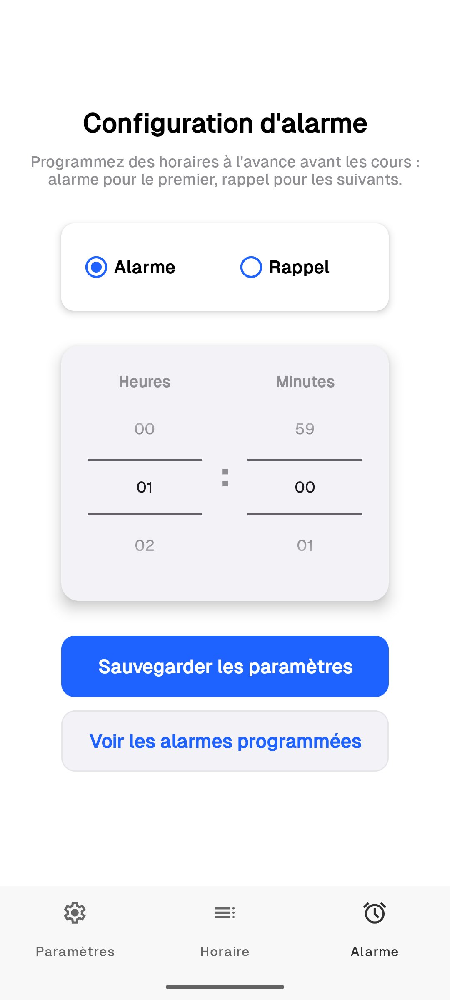
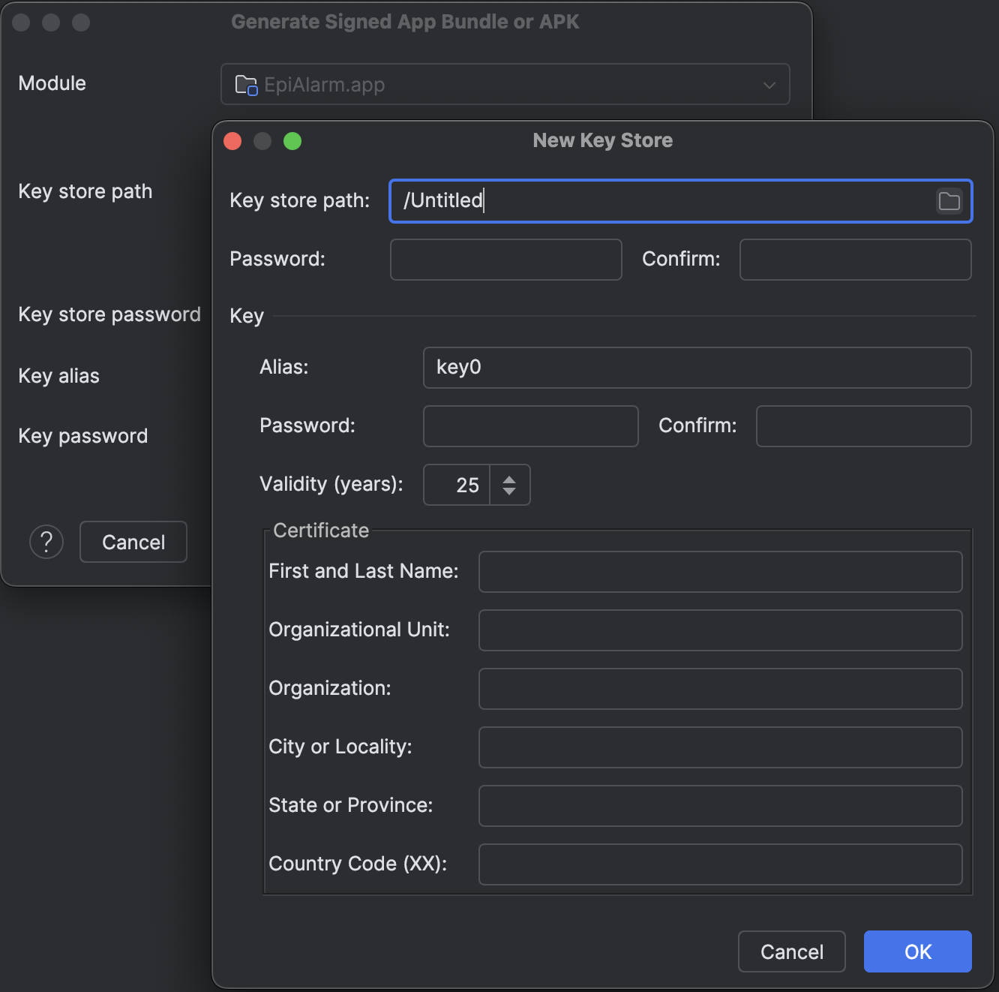

# EPIAlarm Android application

### Alarme intelligente pour les étudiants de group IONIS

## Description

Cette application vous permet vous connectez en utitilisant votre compte d'école, regardez vos horaires et mettez les alarmes automatiquement sur la base de vos horaires





## How to build

### Prérequis

* Microsoft Azure account
* Android Studio

### Step 1

Pour vous connecter cette appli utilise Microsoft Authentication.
Suivez [cette](https://learn.microsoft.com/en-us/azure/active-directory-b2c/configure-authentication-sample-android-app?tabs=java) guide pour comprendre comment ça marche

### Step 2

Générez 2 clés, Debug and Release. Pour faire ça dans Android Studio allez Build -> Generate Signed App Bundle or APKs -> APK -> Create New


 


(N'oubliez pas tous les mots de passe et noms que vous avez saisissez!)

Créez 2 fichiers dans le dossier de projet ```keystore.properties``` et ```keystore.properties.release```. Chaque fichier doit contenir properties suivantes:

```agsl
keyAlias=your-key
keyPassword=key-password
storePassword=keystore-password
storeFile=/path/to/keystore
```
Mettre là properties des clés que vous avez créées

### Step 3
Saissez le commande suivante pour obtenir Base64(signature hash):

```agsl
keytool -list -v -keystore your-keystore -alias your-alias | grep SHA1 | awk '{print $2}' | tr -d ':' | xxd -r -p | base64
```

Créez fichier local.properties:

```agsl
sdk.dir=/path/to/your/Android/sdk
MSAL_HOST=anchovy.team.epialarm
MSAL_PATH=/
MSAL_PATH_BUNDLE=/
```
Mettez Debug signature dans ```MSAL_PATH``` et Release signature dans ```MSAL_PATH_BUNDLE```

### Step 4
Ajoutez les signature hashes à Microsoft Azure App Registration et copiez la configuration MSAL.
Ajoutez ```"account_mode": "SINGLE"```. Ça devrait ressembler à ceci:
```agsl
{
  "client_id" : "votre-client-id",
  "authorization_user_agent" : "DEFAULT",
  "redirect_uri" : "msauth://anchovy.team.epialarm/votre-sgnature-hash",
  "account_mode": "SINGLE",
  "authorities" : [
    {
      "type": "AAD",
      "audience": {
        "type": "AzureADMultipleOrgs",
        "tenant_id": "organizations"
      }
    }
  ]
}


```

Créez 2 fichiers dans ```EPIAlarm/app/src/main/res/raw``` qui s'appellent ```auth_config_apk.json``` et coller MSAL Configuration avec Debug signature et
```auth_config_bundle.json``` avec Release.
Créez un fichier vide ```auth_config_single_account.json```

### Step 5
Maintenant, vous pouvez build et run EPIAlarm
```./gradlew buildRelease```(for example)
