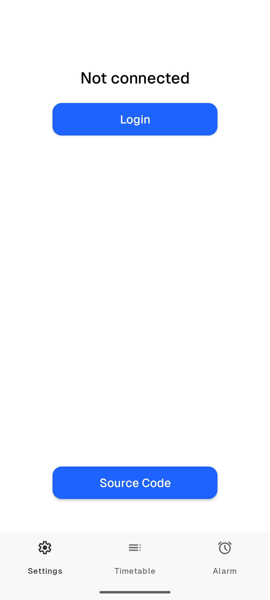
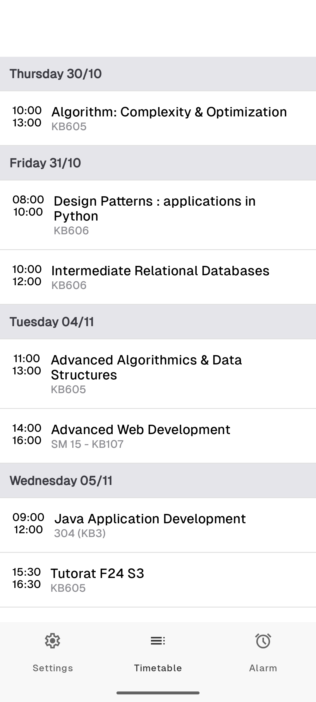
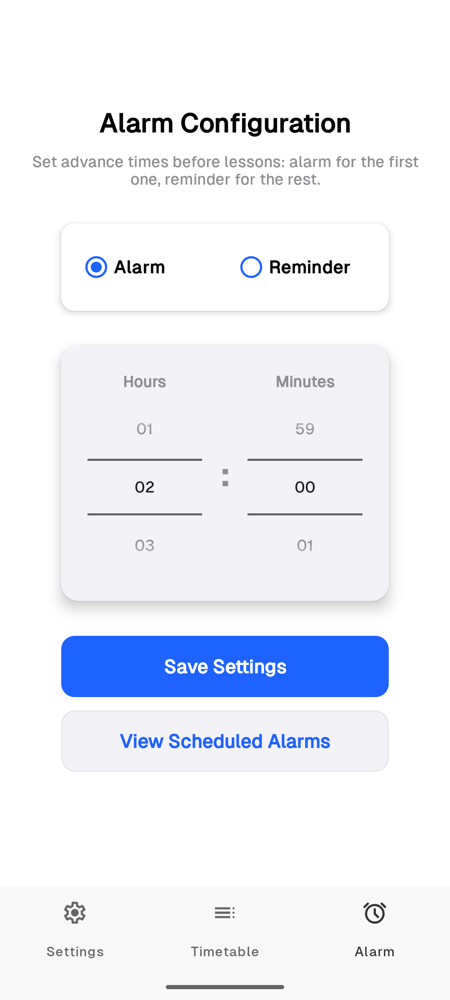

# EPIAlarm Android application

### Smart alarm for IONIS Group students

## Description

This application allows you to connect using your school account, see your timetable and automatically set up the alarms based on that.






## How to build

### Pre-requirements

* Microsoft Azure account
* Android Studio

### Step 1

To login this application uses Microsoft Authentication.
Follow [this](https://learn.microsoft.com/en-us/azure/active-directory-b2c/configure-authentication-sample-android-app?tabs=java) guide to understand how it works

### Step 2

 Generate 2 keys, Debug and Release. To do that in Android Studio you can go Build -> Generate Signed App Bundle or APKs -> APK -> Create New


 


 (Remember all the passwords and names that you specified!)

Create 2 files in the project directory ```keystore.properties``` and ```keystore.properties.release```. Each file should have following properties:

```agsl
keyAlias=your-key
keyPassword=key-password
storePassword=keystore-password
storeFile=/path/to/keystore
```
Put there properties of keys that you created

### Step 3
Get Base64(signature hash) of your keys with following command:

```agsl
keytool -list -v -keystore your-keystore -alias your-alias | grep SHA1 | awk '{print $2}' | tr -d ':' | xxd -r -p | base64
```

Create file local.properties with following fields:

```agsl
sdk.dir=/path/to/your/Android/sdk
MSAL_HOST=anchovy.team.epialarm
MSAL_PATH=/
MSAL_PATH_BUNDLE=/
```
Put Debug signature in ```MSAL_PATH``` and Release signature in ```MSAL_PATH_BUNDLE```

### Step 4

Add signature hashes on Microsoft Azure App Registration and copy MSAL Configuration. Add ```"account_mode": "SINGLE"```
It should look like this:
```agsl
{
  "client_id" : "your-client-id",
  "authorization_user_agent" : "DEFAULT",
  "redirect_uri" : "msauth://anchovy.team.epialarm/your-sgnature-hash",
  "account_mode": "SINGLE",
  "authorities" : [
    {
      "type": "AAD",
      "audience": {
        "type": "AzureADMultipleOrgs",
        "tenant_id": "organizations"
      }
    }
  ]
}


```

Create 2 files in ```EPIAlarm/app/src/main/res/raw``` called ```auth_config_apk.json``` and paste MSAL Configuration with Debug key signature and
```auth_config_bundle.json``` with Release key.
Create empty file ```auth_config_single_account.json```

### Step 5
Now you can build and run EPIAlarm
```./gradlew buildRelease```(for example)